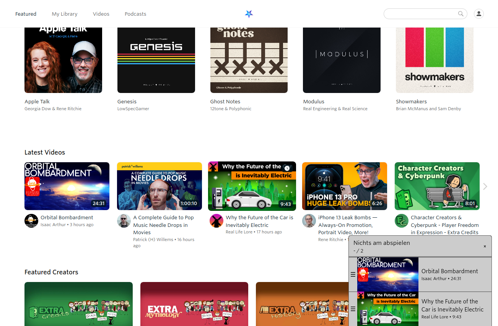
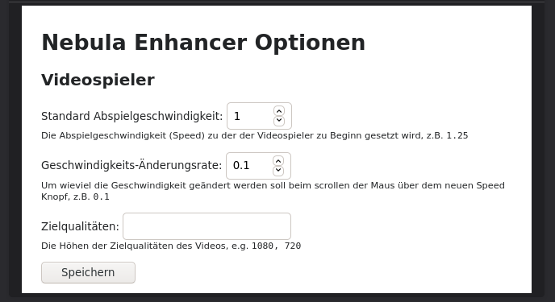

[English](README.md) / [Deutsch](README.DE.md)

# Enhancer for Nebula

Stark inspiriert von [Enhancer for YouTube&trade;](https://www.mrfdev.com/enhancer-for-youtube)

Diese Erweiterung will nützliche Features zur Nebula Seite bringen. Im Moment werden nur Änderungen am Videospieler ausgeführt.

# Installierung

Die Erweiterung ist verfügbar in den offiziellen Add-On Stores:

- Firefox: [Bei Mozilla holen](https://addons.mozilla.org/de-DE/firefox/addon/enhancer-for-nebula/)
- Chromium: [Bei Chrome Webstore holen](https://chrome.google.com/webstore/detail/enhancer-for-nebula/niaholaehmipmbpoagjmdlocnhakeonl)

Die neuesten Veröffentlichungen sind [hier](https://github.com/cpiber/NebulaEnhance/releases) verfügbar.

Bitte beachten Sie, dass sowohl Mozilla als auch Google meine Änderungen überprüfen müssen, bevor diese sichtbar gemacht werden in den Stores. Besonders für den Chrome Webstore kann diese länder dauern.

# Features

**Seite**
- Queue: Füge Videos einfach zu einer Warteschlange hinzu

**Videospieler**
- Standard Abspielgeschwindigkeit und Lautstärke: Erlaubt es, standardmäßig Videos mit anderer Geschwindigkeit und Lautstärke abzuspielen
- "Quick dial" für Abspielgeschwindigkeit: Ein neuer Knopf im Videospieler erlaubt es per Mausrad die Geschwindigkeit bequem und schnell zu verändern
- Autoplay: Videos können automatisch gestartet werden
- Zielqualitäten: Erlaubt es, bevorzugte Videoqualität(en) zu setzen
- Keyboard shortcuts: Tastaturkürzel für einfachere und schnellere Bedienung ([siehe Playback Sektion](https://www.mrfdev.com/youtube-keyboard-shortcuts))

**Custom scripts**
- Benutzerdefinierte Scripts, die im iFrame des Videospielers und auf der Webseite ausgeführt werden

Beachten Sie, dass der Videospieler automatisch fokusiert wird, um die Tastaturkürzel funktional zu machen.

Mehr in Planung. Falls Sie Vorschläge haben, öffnen Sie bitte eine neue [issue](https://github.com/cpiber/NebulaEnhance/issues).

# Screenshots

Video Schlange:

Speed dial:

Optionen Seite:

# Entwickeln

Stellen Sie bitte sicher, dass Sie [NodeJS](https://nodejs.org/) und dessen package manager [npm](https://www.npmjs.com/) installiert haben.

- [pnpm](https://github.com/pnpm/pnpm) installieren: `npm install -g pnpm`
- Abhängigkeiten installieren: `pnpm install`
- Entwickeln: In Firefox `pnpm run start:firefox` / In Chromium `pnpm run start:chromium`
- Builden: `pnpm run build`
