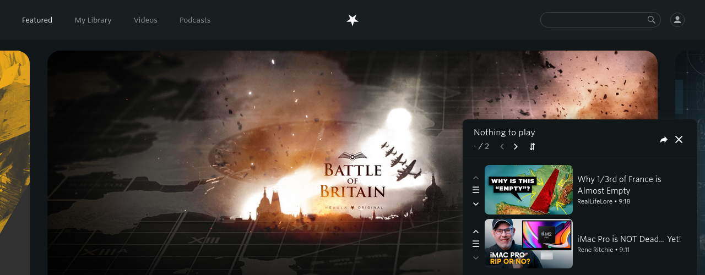
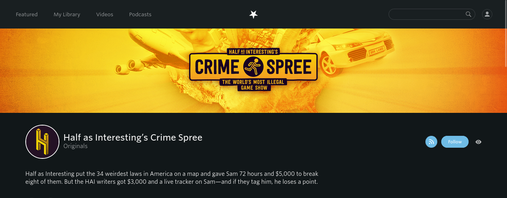

<!-- LTeX: language=de-DE -->

[English](README.md) / [Deutsch](README.DE.md)

# Enhancer for Nebula

Stark inspiriert von [Enhancer for YouTube&trade;](https://www.mrfdev.com/enhancer-for-youtube)

Diese Erweiterung will nützliche Features zur [Nebula](https://nebula.app) Seite bringen.

# Installierung

Die Erweiterung ist verfügbar in den offiziellen Add-On Stores:

- Firefox:  
- Chromium: 

Die neuesten Veröffentlichungen sind [hier](https://github.com/cpiber/NebulaEnhance/releases) verfügbar.

Bitte beachten Sie, dass sowohl Mozilla als auch Google meine Änderungen überprüfen müssen, bevor diese sichtbar gemacht werden in den Stores.

# Features

**Seite**
- Queue: Füge Videos einfach zu einer Warteschlange hinzu
- Teilen: Schlange kann jetzt geteilt werden -- Teilen Sie Ihre Liste oder legen Sie Lesezeichen dafür an!
- YouTube Link: Die Erweiterung kann versuchen, das passende YouTube-Video zu finden (Aktivierung in den Einstellungen)
- Watch on Nebula: Auf jeder YouTube Video-Seite wird versucht, das passende Nebula Video zu finden (Aktivierung in den Einstellungen)
  - Optional auch automatisch direkt in neuem Tab öffnen
- Hide creators: Lässt Videos von gewissen Kanälen verschwinden
- RSS: Feed button für Kanäle
- Markiert besuchte Links (angesehene Videos)
- ~~Theater Modus: Videospieler wird besser an die Seite angepasst~~ Jetzt nativ unterstützt

**Videospieler**
- "Quick dial" für Abspielgeschwindigkeit: Ein neuer Knopf im Videospieler erlaubt es per Mausrad die Geschwindigkeit zu verändern
- Scroll über Videospieler um Lautstärke zu ändern (Aktivierung in den Einstellungen)
- Zeit-Anzeige lässt sich zwischen aktueller und verbleibender Zeit wechseln
- Kontrolle über Video Autoplay
- Keyboard Shortcuts: Tastaturkürzel für einfachere und schnellere Bedienung ([siehe Playback Sektion](https://www.mrfdev.com/youtube-keyboard-shortcuts))
- ~~Standard Abspielgeschwindigkeit und Lautstärke: Erlaubt es, standardmäßig Videos mit anderer Geschwindigkeit und Lautstärke abzuspielen~~ Jetzt nativ unterstützt
- ~~Zielqualitäten: Erlaubt es, bevorzugte Videoqualität(en) zu setzen~~ Jetzt nativ unterstützt

**Custom scripts**
- Benutzerdefinierte Scripts, die auf der Webseite ausgeführt werden

Falls Sie Vorschläge haben, öffnen Sie bitte ein neues [Issue](https://github.com/cpiber/NebulaEnhance/issues) oder starten Sie eine [Diskussion](https://github.com/cpiber/NebulaEnhance/discussions/new).

# [Screenshots](/static/)

| Seitenupdates | Videospielerupdates |
| :---: | :---: |
|  |  |
| Video Schlange | Videospieler mit neuen Kontrollknöpfen (Video Schlange nächstes/voriges, Lautstärke Indikator, Zeit verbleibend, Quick Dial) |
|  | |
| Kanal mit "Hide creator" und RSS buttons | |

# Entwickeln

Siehe [DEVELOPING.md](DEVELOPING.md) (nur in Englisch)