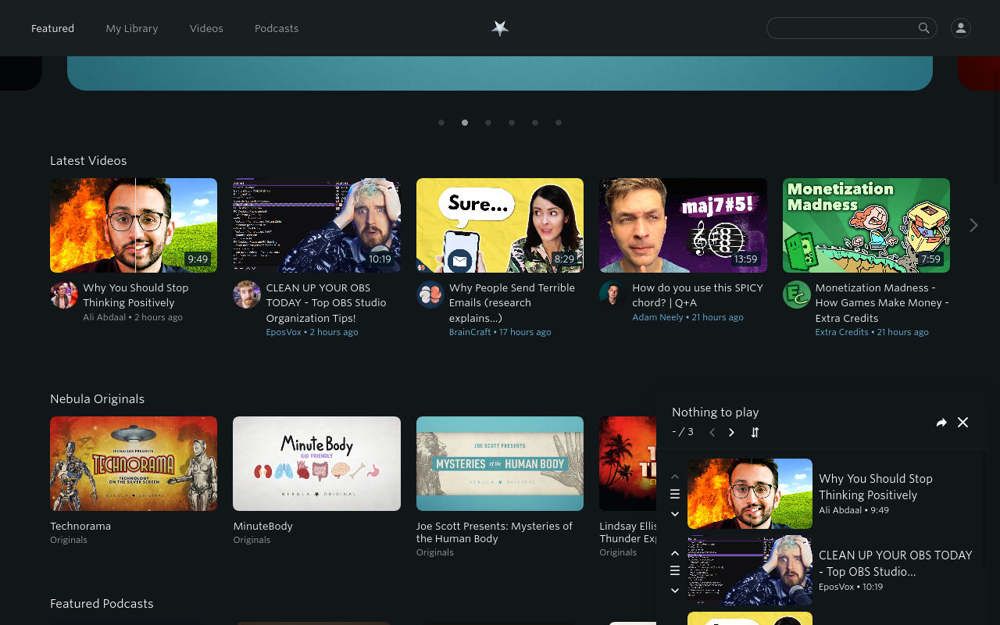
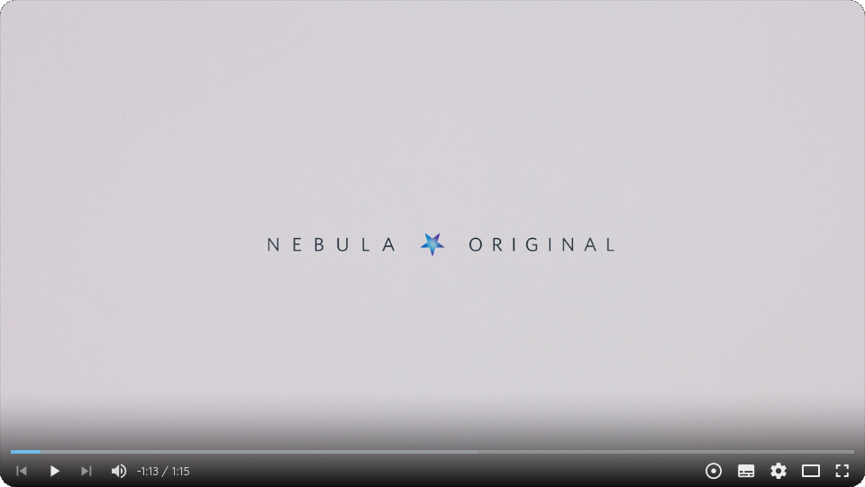
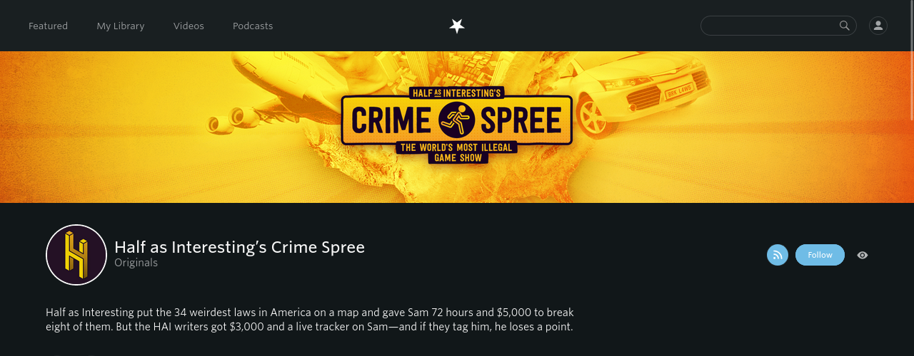

<!-- LTeX: language=en-US -->

[English](README.md) / [Deutsch](README.DE.md)

# Enhancer for Nebula

Heavily inspired by [Enhancer for YouTube&trade;](https://www.mrfdev.com/enhancer-for-youtube)

This extension aspires to bring some useful features to the [Nebula](https://nebula.tv) site.

# Installing

This extension is available on the official add-on stores:

- Firefox:  
- Chromium: 

The most recent releases are available [here](https://github.com/cpiber/NebulaEnhance/releases) for installing manually.
Installing the `enhancer_for_nebula-<version>.zip` should work on any browser that supports MV2.
For [MV3](https://developer.chrome.com/docs/extensions/develop/migrate/what-is-mv3)-only browsers (Chromium based), use the `enhancer_for_nebula-v3-<version>.zip`.
The `enhancer_for_nebula-<version>.xpi` is produced and signed by Mozilla.

Please be aware that both Mozilla and Google need to verify my changes before making them visible in the stores.

# Features

**Page**
- Queue: Add videos to watch queue
- Share: Queue is shareable -- Bookmark and Share your list!
- YouTube Link: This extension can try to find the corresponding YouTube video (enable in settings)
- Watch on Nebula: On any YouTube video page tries to find the corresponding Nebula video (enable in settings)
  - Optionally automatically open it in a new tab
- Hide creators: Enables you to hide videos by certain creators
- RSS: Add feed button to creator page
- Style visited links to mark watched videos
- ~~Theatre Mode: Make the player fit the page better~~ Now natively supported

**Player**
- Quick dial to set speed: New button in player to increase/decrease speed by scrolling
- Scroll over player to set volume (enable in settings)
- Toggle time display between current/remaining time
- Control Nebula video autoplay
- Keyboard shortcuts: Additional shortcuts in video player ([see Playback section](https://www.mrfdev.com/youtube-keyboard-shortcuts))
- ~~Default playback speed and volume, subtitles~~ Now natively supported
- ~~Target qualities: Set the preferred video quality or qualities~~ Now natively supported

**Custom scripts**
- Execute custom JavaScript code on the web page (MV2 only)

If you have any suggestions, please open a new [issue](https://github.com/cpiber/NebulaEnhance/issues) or start a [discussion](https://github.com/cpiber/NebulaEnhance/discussions/new).

# [Screenshots](/static/)

| Page updates | Player updates |
| :---: | :---: |
|  |  |
| Queue | Player with new controls (Queue next/previous, volume indicator, time remaining, quick dial) |
|  | |
| Channel with "Hide creator" and RSS buttons | |

# Developing

See [DEVELOPING.md](DEVELOPING.md)

# Credits

Icon made by [Freepik](https://www.freepik.com) from [www.flaticon.com](https://www.flaticon.com/) and modified.

Several icons from [SVGrepo](https://www.svgrepo.com/).

Theme by @groenroos.
