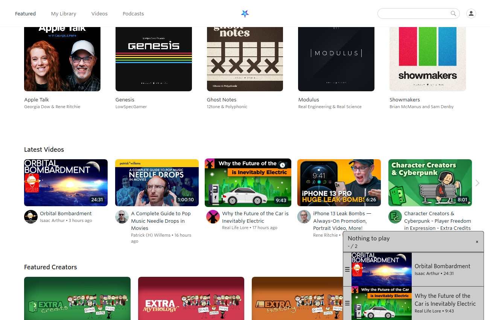

<!-- LTeX: language=en-US -->

[English](README.md) / [Deutsch](README.DE.md)

# Enhancer for Nebula

Heavily inspired by [Enhancer for YouTube&trade;](https://www.mrfdev.com/enhancer-for-youtube)

This extension aspires to bring some useful features to the [Nebula](https://nebula.app) site.

# Installing

This extension is available on the official add-on stores:

- Firefox:  
- Chromium: 

The most recent releases are available [here](https://github.com/cpiber/NebulaEnhance/releases).

Please be aware that both Mozilla and Google need to verify my changes before making them visible in the stores. Especially for the Chrome Webstore this takes time.

# Features

**Page**
- Queue: Add videos to watch queue
- Share: Queue is shareable -- Bookmark and Share your list!
- YouTube Link: This extension can try to find the corresponding YouTube video (enable in settings)
- ~~Theatre Mode: Make the player fit the page better~~ Now natively supported

**Player**
- Quick dial to set speed: New button in player allows to increase/decrease speed by scrolling
- Scroll over player to set volume (enable in settings)
- Autoplay: Start videos automatically
- Keyboard shortcuts: Shortcuts in video player ([see Playback section](https://www.mrfdev.com/youtube-keyboard-shortcuts))
- ~~Default playback speed and volume, subtitles~~ Now natively supported
- ~~Target qualities: Set the preferred video quality or qualities~~ Now natively supported

**Custom scripts**
- Execute custom JavaScript code on the web page

More to come. If you have any suggestions, please open a new [issue](https://github.com/cpiber/NebulaEnhance/issues).

# Screenshots

Queue:

Player with new controls (Queue next/previous, volume indicator, quick dial):

# Developing

See [DEVELOPING.md](DEVELOPING.md)