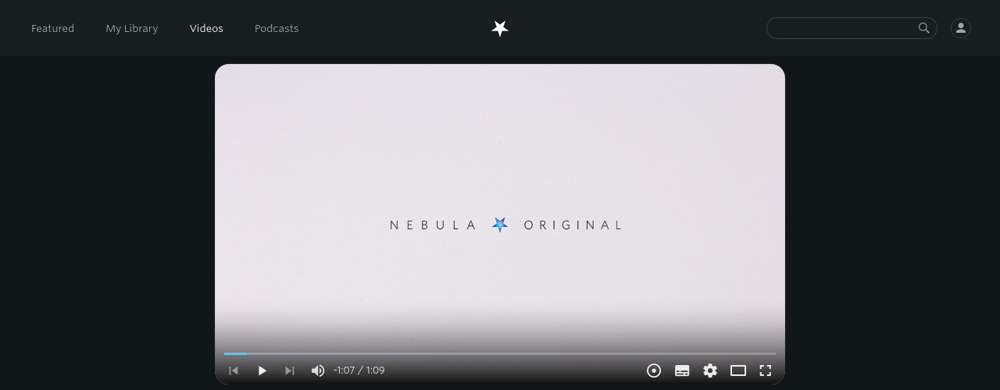

[English](README.md) / [Deutsch](README.DE.md)

# Enhancer for Nebula

Heavily inspired by [Enhancer for YouTube&trade;](https://www.mrfdev.com/enhancer-for-youtube)

This extension aspires to bring some useful features to the [Nebula](https://watchnebula.com) site.

# Installing

This extension is available on the official add-on stores:

- Firefox: [Get from Mozilla](https://addons.mozilla.org/en-US/firefox/addon/enhancer-for-nebula/)
- Chromium: [Get from Chrome Webstore](https://chrome.google.com/webstore/detail/enhancer-for-nebula/niaholaehmipmbpoagjmdlocnhakeonl?hl=de)

The most recent releases are available [here](https://github.com/cpiber/NebulaEnhance/releases).

Please be aware that both Mozilla and Google need to verify my changes before making them visible in the stores. Especially for the Chrome Webstore this takes time.

# Features

**Page**
- Queue: Add videos to watch queue
- Share: Queue is shareable -- Bookmark and Share your list!

**Player**
- Default playback speed and volume
- Quick dial to set speed: New button in player allows to increase/decrease speed by scrolling
- Autoplay: Start videos automatically
- Target qualities: Set the preferred video quality or qualities
- Keyboard shortcuts: Shortcuts in video player ([see Playback section](https://www.mrfdev.com/youtube-keyboard-shortcuts))

**Custom scripts**
- Execute custom JavaScript code in the player's iFrame and on the web page

Note that the player is automatically focused to make the keyboard shortcuts work.

More to come. If you have any suggestions, please open a new [issue](https://github.com/cpiber/NebulaEnhance/issues).

# Screenshots

Queue:

Speed dial:

Options page:

# Developing

Please make sure you have [NodeJS](https://nodejs.org/) and it's package manager [npm](https://www.npmjs.com/) installed.

- Install [pnpm](https://github.com/pnpm/pnpm): `npm install -g pnpm`
- Install dependencies: `pnpm install`
- Develop: In Firefox `pnpm run start:firefox` / In Chromium `pnpm run start:chromium`
- Build: `pnpm run build`
